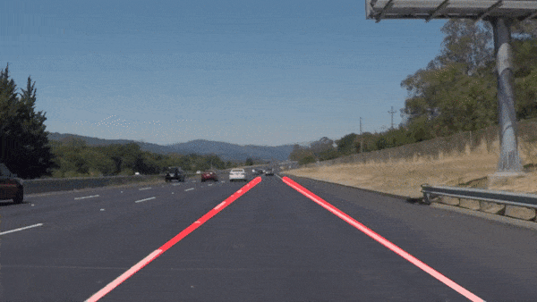

# **Finding Lane Lines on the Road** 

Overview
---

When we drive, we use our eyes to decide where to go.  The lines on the road that show us where the lanes are act as our constant reference for where to steer the vehicle.  Naturally, one of the first things we would like to do in developing a self-driving car is to automatically detect lane lines using an algorithm.

## Following are the steps in the pipeline:

Step1: Convert image to Gray scale.

Step2: Introduce Gaussian blur to reduce the surrounding noise.

Step3: Process Canny edge detection on the output of Step2 to identify the edges.

Step4: Introduce the Region of Interest (RoI) mask on the output from Step3. This will help us
process the only the desired part in the following steps.

Step5: Process Hough Transform on the masked image which shall return (x,y) of the lines.

Step6: Based on the slope of line categorize the points as points on left and right.

Step7: Identify the farthest detected point on the respective lines and also normalize the slopes for
each side by averaging.

Step8: From the slope and the identified points, calculate the point which shall be at the rear-end of
ROI and also the point which shall be the apex of ROI, for line on each side.

The image shows identified lane markings in red.

# Output Videos

## Potential shortcomings:

1. The logic assumes that always some points on either side of Lane markings are identified.
2. The logic doesn’t support curved lanes as the equation is straight line fitting equation.

## Possible improvements:

1. The code can be improved to accurately calculate curvature and fit the equation accordingly.
2. The code can be made more flexible in term of availability of certain data.

